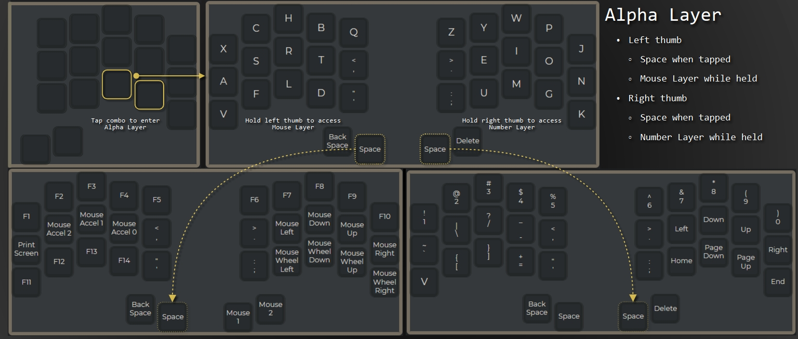
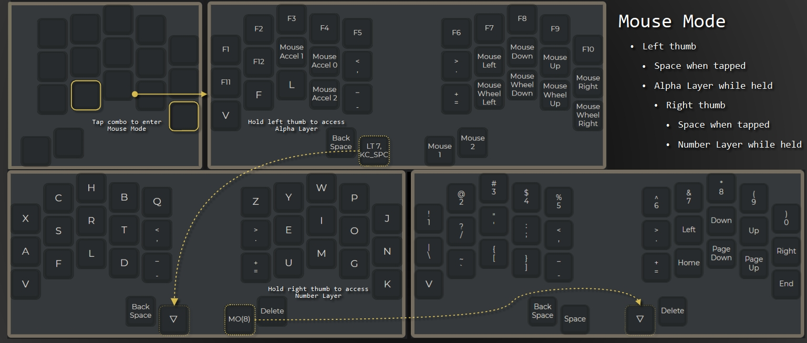
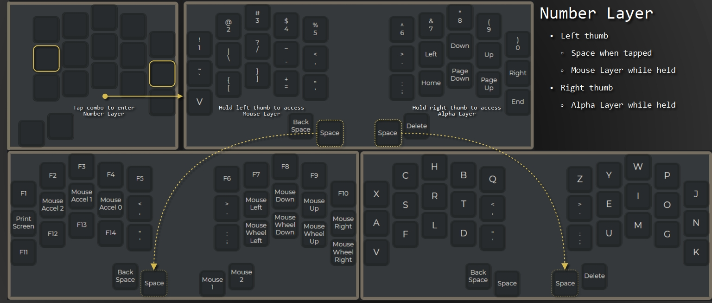
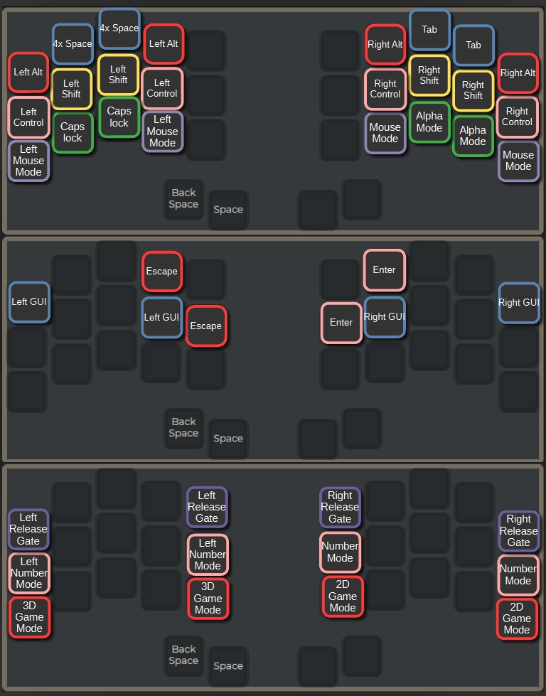
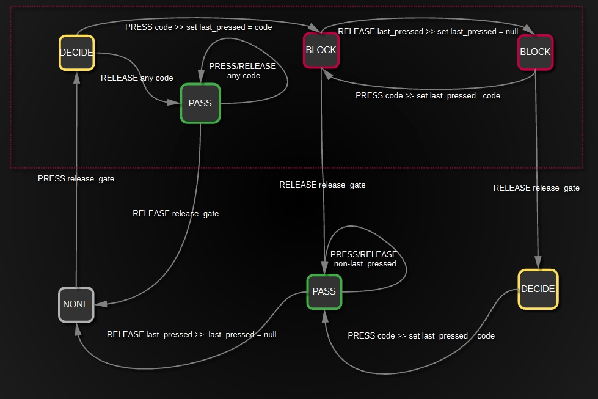

# noonyworld 

There are 3 layers: Alpha Layer, Mouse Layer, and Number Layer. From any of those layers, the other two layers can be momentarily accessed by holding either of the space buttons. The visuals below should clarify this.   

---  

  

---  

  

Note: Since holding down the left-click button is a common use case, you must first access the Alpha Layer with the left thumb before accessing the Number Layer with the right thumb.  

---  

  

## Combos  

The caps-lock combo only turns caps-lock on. Caps-lock is turned off when a modifier or mode-switching combo is pressed.   

  

## Release Gate

In the last section you may have noticed combos for Left Release Gate and Right Release Gate. This feature is used when you need to press multiple keys at the same time, but those keys are located on different layers from each other. While the Release Gate is held, the keyboard will not send key-release signals to the computer. Once you release a key without the Release Gate held, all previously withheld release signals will be sent. If you don't think you understand, try playing with the feature. It's pretty simple and you'll probably never need it.  

  

## Bonus: Game Layers   

 
